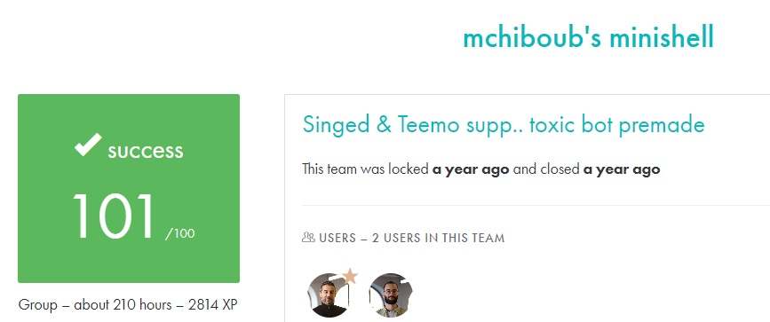

# MINISHELL #

## What the project does: ##
The Minishell project involves creating a simple shell, similar to Bash. It can execute commands, handle input/output redirection, manage pipes, and interpret environment variables. It also implements basic built-in commands like echo, cd, pwd, export, unset, env, and exit.

## Why the project is useful: ##
This project is useful because it deepens your understanding of system programming, specifically processes, file descriptors, and signals. It gives you hands-on experience with the inner workings of a command-line interface, a fundamental component of operating systems.

[Subject of this project](en.subject.pdf)